### Data Analysis Overview

The dataset contains information about 10,000 books, captured through multiple metrics such as ratings, publication years, and author details. Analyzing this data provides valuable insights into trends and patterns in literature based on reader engagement and book attributes.

---

### Summary Statistics

- **Book Identification**: 
  - **book_id** ranges from 1 to 10,000 with a mean of 5000.5 and a standard deviation of approximately 2887.
  - **goodreads_book_id**, **best_book_id**, and **work_id** show similar trends with higher mean values, reflecting the unique identifiers used by Goodreads for books and works.

- **Publications**:
  - The **original_publication_year** has a mean of approximately 1982, indicating that a significant number of books were published in the late 20th century. The range extends back to 1750, with the latest publication year at 2017.

- **Book Attributes**:
  - The **books_count** per book varies vastly, with a maximum of 3455 indicating prolific authors or series; the average is around 76.
  - The **isbn13** field shows a broader variation, reflecting different publishing standards and formats.

- **Rating Metrics**:
  - The average rating across books is about **4.00**, with a limited standard deviation of **0.25**, suggesting a generally positive reception among readers. The ratings distribution shows significant concentrations in the higher rating brackets (4 and 5 stars).
  - **ratings_count** and **work_ratings_count** metrics indicate a wide range of reader engagement; the former indicates an average of 54,001 ratings per book.

---

### Missing Values & Data Completeness

Several critical fields have missing entries:
- **ISBN** fields are missing values, which could affect searchability and data linkage.
- **Original title** and **language code** fields also contain numerous NaNs.

Overall, the data is reasonably complete with only a few fields having significant missing values, which can be addressed through further data collection or imputation methods.

---

### Correlation Analysis

The correlation metrics highlight relationships between different identifiers and book counts. Notably, **work_id** and **goodreads_book_id** have a substantial correlation, indicating that these metrics might show direct associations regarding the popularity or categorization of works.

---

### Outlier Detection

Outliers exist across various metrics, primarily regarding ratings and count data. These may indicate significant anomalies that could be further investigated, such as books with either exceptionally high or low engagement metrics compared to their peers. 

---

### Advanced Analysis

Clustering analyses revealed three primary groups within the dataset, highlighted by different average rates of reader engagement, publication years, and book counts. This segmentation suggests a variety of audience interests and publication characteristics across different literary genres or time spans.

- **Cluster 1**: Predominantly features books from the late 20th century with moderate engagement.
- **Cluster 2**: Comprises highly rated books with substantial engagement, typical of popular contemporary works.
- **Cluster 3**: Contains lesser-known titles exhibiting lower counts but perhaps a niche audience.

---

### Visual Distillation of Insights

Visualizations confirm the statistical analysis, indicating:
- The **distribution of average ratings** is right-skewed toward 5 stars.
- **Publication year distributions** suggest a steep drop in published works in recent decades compared to earlier ones.
- **Ratings distributions** not only affirm high engagement but demonstrate a fascinating trend of clustered ratings suggesting a loyal reader base for certain titles, particularly in genres represented by prolific authors.

---

### Conclusion

The dataset provides a rich tapestry illustrating the landscape of literature, capturing themes of reader engagement, publication trends, and author prolificacy. While positive ratings prevail, the insights derived from the clustering and correlation analyses reveal deeper undercurrents of reader interest and market segmentation. Addressing missing values and outliers will further enhance the utility of this dataset for targeted marketing and recommendation systems in the book industry.

## Visualizations
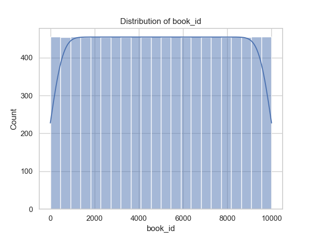
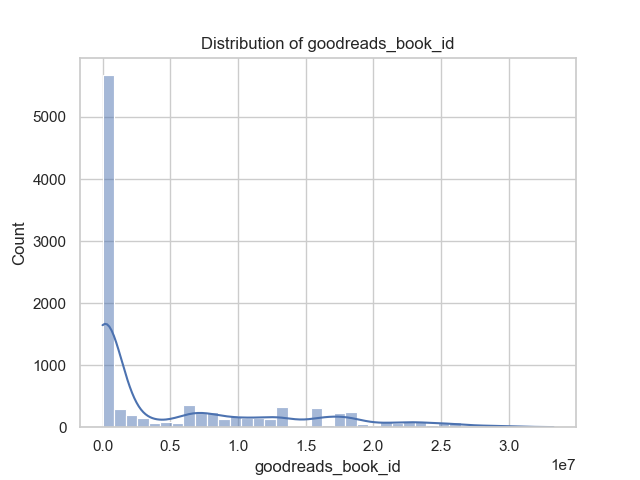
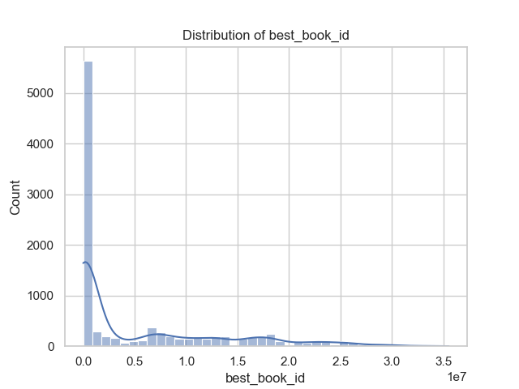
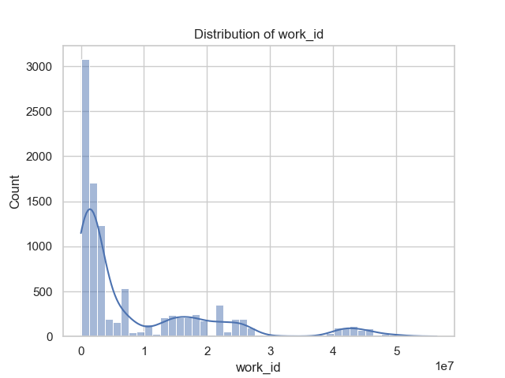
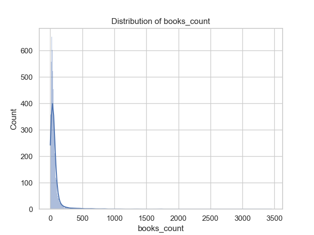
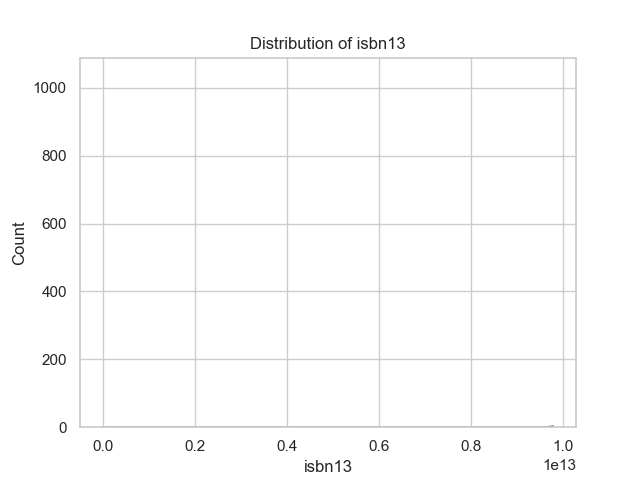
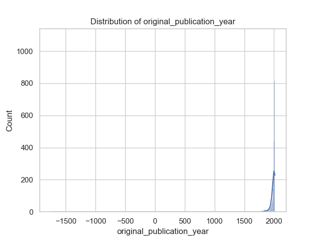
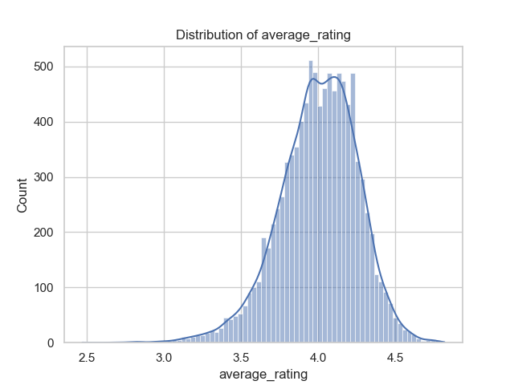
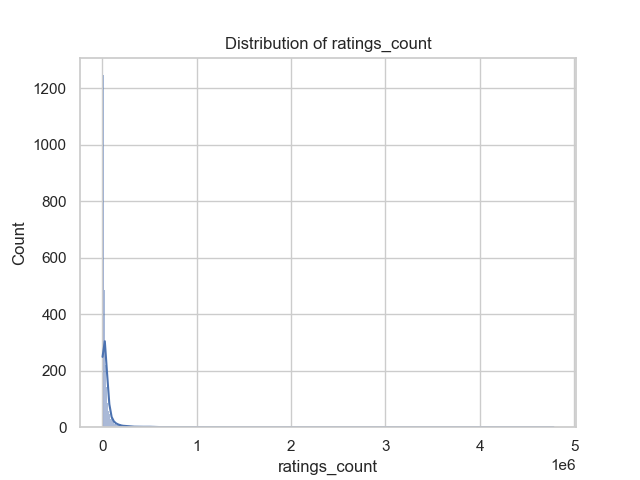
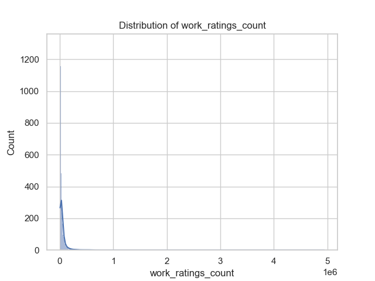
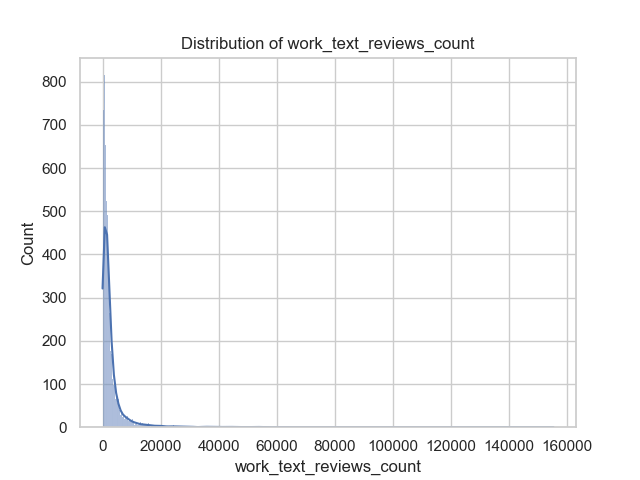
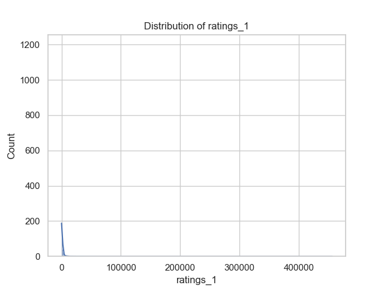
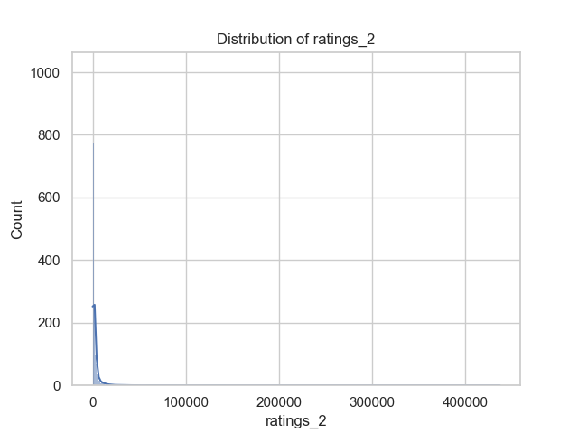
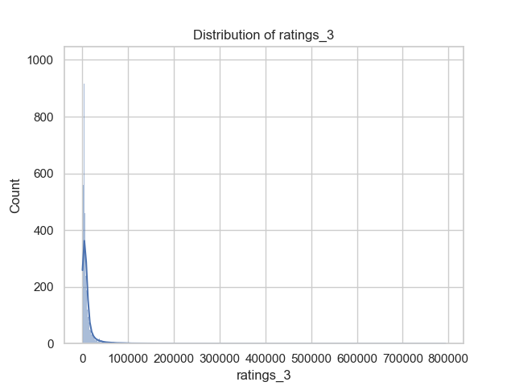
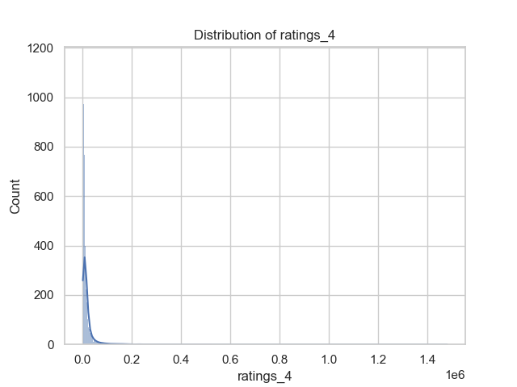
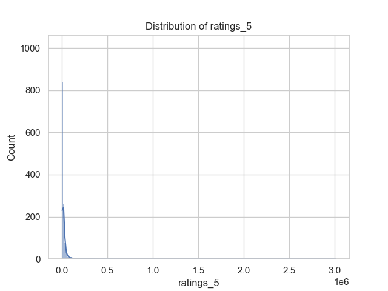
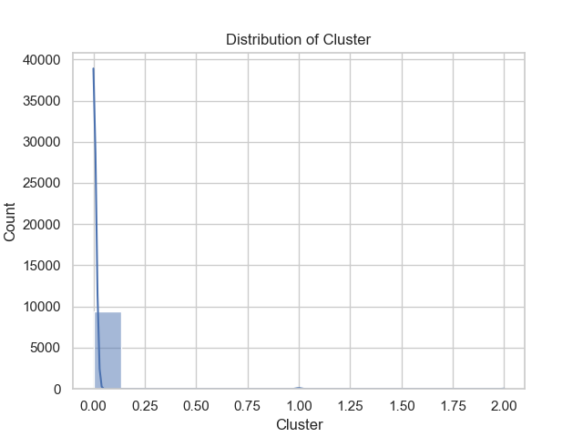
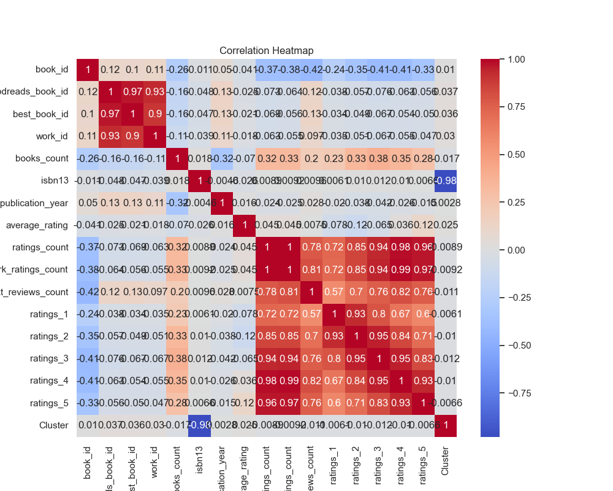
