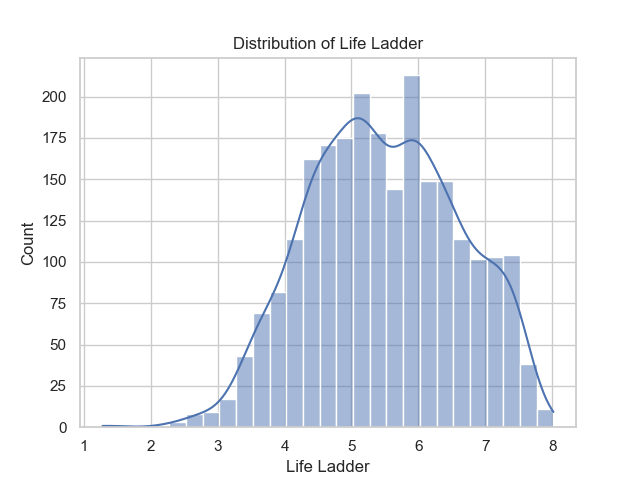

### Summary of Analysis

The data set encompasses happiness metrics across 165 countries from 2005 to 2023, providing insights into various factors influencing well-being. With a total of 2,363 entries, certain variables reveal patterns and trends crucial for understanding life satisfaction globally.

#### Key Findings

1. **Demographics and Coverage**: 
   - The dataset includes 2363 entries with 165 unique countries, showing Lebanon as the most frequently represented country (18 times). This diversity in coverage enables a multi-national perspective on happiness.

2. **Temporal Trends**:
   - The mean year of data collection is approximately 2014.76, with a broad distribution from 2005 to 2023. This span allows for a longitudinal view of happiness and its evolution over time.

3. **Life Ladder Ratings**:
   - The average 'Life Ladder' score across the dataset is 5.48, indicating a global median sense of well-being. Scores ranged from a minimum of 1.281 to a maximum of 8.019, revealing significant disparities in happiness among countries.

4. **Economic Indicators**:
   - The **Log GDP per capita** averages at 9.4. Notably, this positively correlates with the Life Ladder score, indicating that higher economic prosperity often corresponds with higher levels of perceived happiness.

5. **Social Support**:
   - On average, social support rates stand at 0.81, suggesting that a supportive community plays a vital role in individual well-being. 

6. **Health Expectations**:
   - The data reveals an average 'Healthy life expectancy at birth' of 63.4 years, with wealthier nations generally enjoying longer and healthier lives. 

7. **Freedom and Generosity**:
   - Average scores for 'Freedom to make life choices' and 'Generosity' are 0.75 and a negligible value close to zero, respectively. The former underscores the impact of personal agency on happiness while the latter indicates a complex relationship between generosity and perceived happiness, possibly reflecting cultural context.

8. **Perception of Corruption**:
   - An average perception score of 0.74 highlights the widespread concern over corruption, suggesting that nations with lower corruption perceptions tend to report higher happiness levels.

9. **Emotional Metrics**: 
   - Average scores for 'Positive affect' at 0.65 and 'Negative affect' at 0.27 indicate a generally positive emotional experience, supporting a positive correlation between these metrics and overall happiness.

10. **Missing Values**: 
    - Some variables, particularly those related to health (healthy life expectancy and perceptions of corruption), have notable missing entries, which could affect comprehensive analyses and conclusions drawn from the data.

11. **Clustering Analysis**:
    - The clustering analysis identified three primary groupings of countries based on happiness-related metrics, reflecting varying degrees of well-being associated with socio-economic factors. Countries in higher clusters exhibit both better economic outputs and social satisfaction.

#### Correlation Insights

Correlation analysis indicates that 'Log GDP per capita', 'Life Ladder', and 'Social support' are significantly correlated with happiness, illustrating the importance of economic stability and supportive environments in enhancing life satisfaction.

#### Visual Insights

Visualizations highlight the following:
- **Distribution of Happiness**: A bell-shaped curve for the Life Ladder scores suggests a typical distribution with most countries falling near the average.
- **Trend Across Years**: The yearly happiness trajectory reflects fluctuations influenced by socio-economic events.
- **Correlation Heatmap**: Key variables exhibit robust relationships, emphasizing the multifaceted nature of happiness.

### Conclusion

The analysis reveals profound connections between economic, social, and health indicators in determining happiness and well-being across nations. While many countries enjoy satisfactory life satisfaction levels, significant diversity points to areas where interventions can make a meaningful difference. Continued research is essential to understand emerging trends and guide policy decisions for improved global happiness.

## Visualizations

