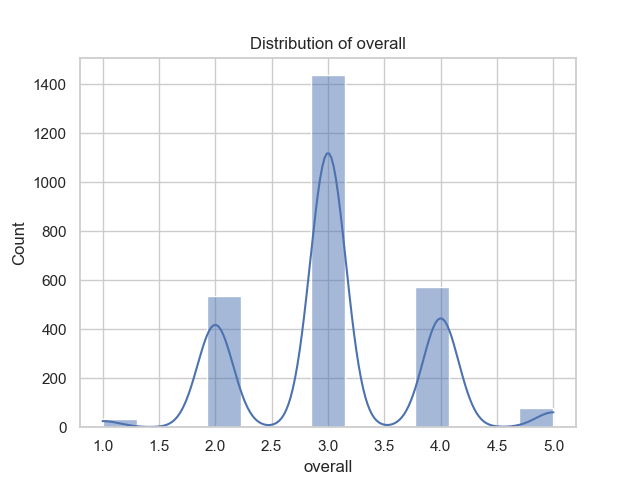
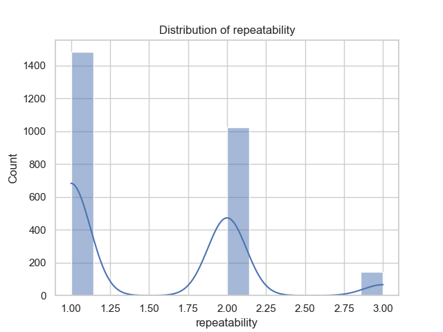
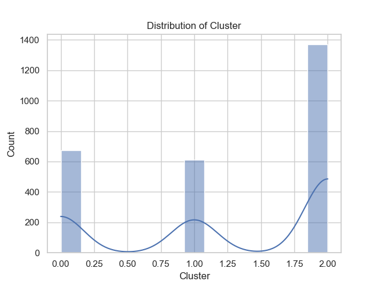
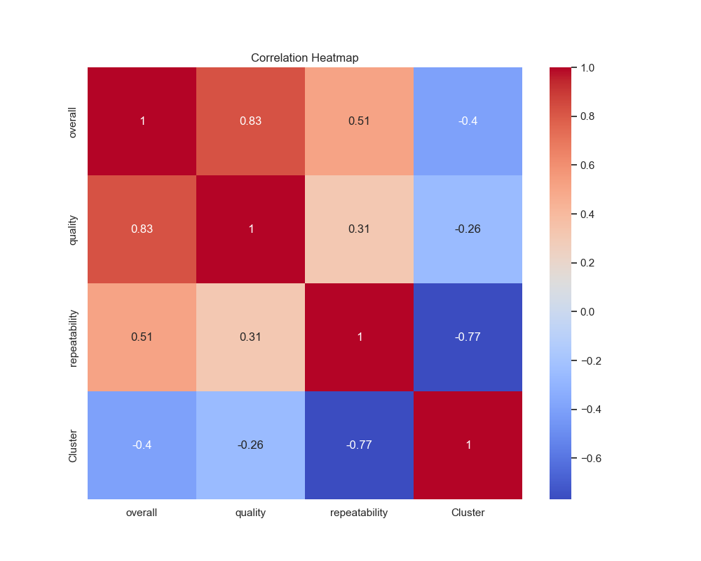

### Data Analysis Summary

#### 1. **Summary Statistics**
The dataset contains a total of **2,652 entries** across various features, with notable details as follows:

- **Date**: Total unique dates are 2,055, with '21-May-06' being the most frequent date (8 occurrences).
- **Language**: There are 11 unique languages, with 'English' being the most common (1,306 occurrences).
- **Type**: The dataset features 8 categories, predominantly 'movie' with 2,211 entries.
- **Title**: A total of 2,312 unique titles are present, with 'Kanda Naal Mudhal' as the most frequently mentioned (9 times).
- **By**: This feature indicates the creators or contributors, with 1,528 unique names; the top contributor is 'Kiefer Sutherland' (48 occurrences).
- **Overall Ratings**: The average rating is approximately **3.05**, with ratings ranging from **1 to 5**. The distribution shows a concentration around the mean with no recorded outliers.
- **Quality Ratings**: The average quality rating is **3.21**, indicating a slightly higher perception of quality compared to overall ratings.
- **Repeatability**: The repeatability score has an average of **1.49**, showing a skew towards lower repeatability in the dataset.

#### 2. **Missing Values**
- The dataset has some missing values, especially in the 'date' (99 missing) and 'by' (262 missing) fields, which may impact analyses that rely on these features.

#### 3. **Correlation Analysis**
- The analysis focuses on three key metrics: `overall`, `quality`, and `repeatability`. The absence of specific correlation coefficients in the provided data limits deeper understanding but indicates potential relationships worth exploring.

#### 4. **Outliers**
- No outliers were detected in the overall, quality, or repeatability scores, suggesting that the ratings are consistent across the dataset.

#### 5. **Advanced Analysis**
- **Cluster Analysis**: The data was divided into three main clusters based on their **overall**, **quality**, and **repeatability** scores, revealing patterns in the underlying data:
  - Cluster 0: Scores around 2.56 (Overall), 2.82 (Quality), and 1.03 (Repeatability).
  - Cluster 1: Higher scores around 3.06 (Overall), 3.11 (Quality), and 2.07 (Repeatability).
  - Cluster 2: The highest scores with averages approaching 4.12 (Overall) and 4.19 (Quality), but with a lower repeatability score of 1.90.

This suggests varying perceptions of quality and engagement amongst different media types or creators.

### Visual Insights
- The **overall distribution** shows a central tendency with most ratings hovering around the mean, reflecting balanced yet slightly favorable perceptions of overall quality.
- The **quality distribution** reinforces that the majority of scores are clustered between 3 and 4, confirming a positive assessment from users.
- The **repeatability distribution** indicates most entries score low on repeatability, potentially signifying that the media is not frequently revisited by the audience.
- The **cluster distribution** visually shows the segmentation of media based on perceived quality and engagement, facilitating targeted strategies for audience engagement.
- The **correlation heatmap** (while the specific values are not detailed) promises insights into which dimensions may be interrelated, guiding further analysis and decision-making.

### Conclusion
This analysis highlights a well-populated dataset with rich information on user ratings and contributions, although attention needs to be directed towards missing values, particularly in 'date' and 'by' fields which could influence outcomes significantly. Continuing to explore the clusters can unearth deeper insights into content engagement and quality perceptions across various media types.

## Visualizations

